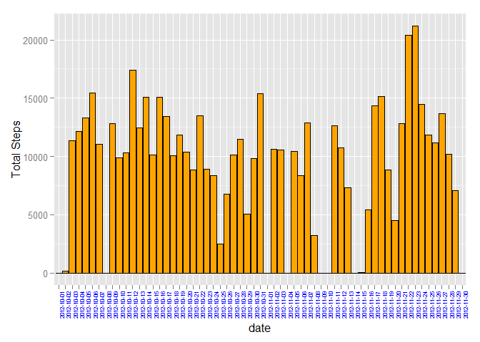
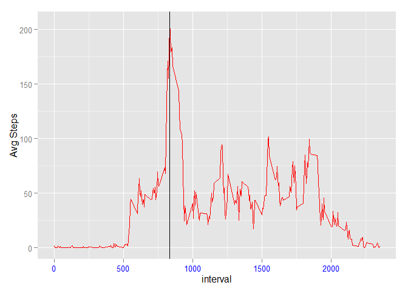
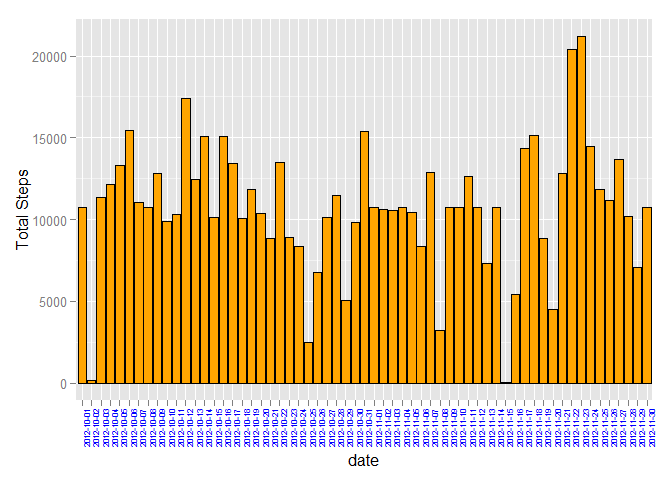
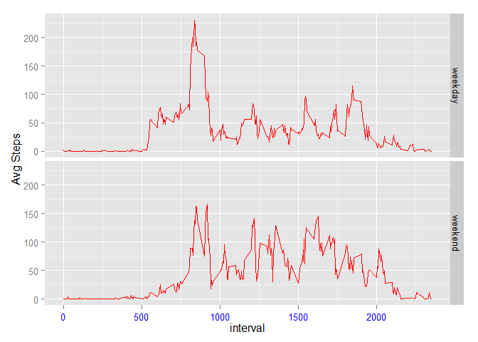

# Reproducible Research: Peer Assessment 1

## Loading and preprocessing the data

1. Load the data
2. Process/transform the data (if necessary) into a format suitable for your analysis
   
   Nothing Much require to process the data. Some analysis to understand the data

```r
readData <- read.csv("C:/Users/ritesh_gandhi/Documents/data/activity.csv")
str(readData)
```

```
## 'data.frame':	17568 obs. of  3 variables:
##  $ steps   : int  NA NA NA NA NA NA NA NA NA NA ...
##  $ date    : Factor w/ 61 levels "2012-10-01","2012-10-02",..: 1 1 1 1 1 1 1 1 1 1 ...
##  $ interval: int  0 5 10 15 20 25 30 35 40 45 ...
```
## What is mean total number of steps taken per day?
1. Make a histogram of the total number of steps taken each day
2. Calculate and report the mean and median total number of steps taken per day

For this section 
- Used aggregate function to SUM the number of steps based on the Date 
- Made Histogram using ggplot to show number of steps taken each day
- Calculated the mean and median on subset of data


```r
subdata <- aggregate(readData$steps, by=list(date=readData$date), FUN=sum, na.rm=T)
names(subdata) <- c("date", "total")

library(ggplot2)
ggplot(subdata, aes(date, total)) + geom_bar(stat = "identity", fill = "orange", color="black") + theme(axis.text.x= element_text(angle=90, size=6, color="blue")) + ylab("Total Steps")
```

 

```r
mean(subdata$total)
```

```
## [1] 9354
```

```r
median(subdata$total)
```

```
## [1] 10395
```
## What is the average daily activity pattern?
1. Make a time series plot (i.e. type = "l") of the 5-minute interval (x-axis) and the average number of steps 
taken, averaged across all days (y-axis)
2. Which 5-minute interval, on average across all the days in the dataset, contains the maximum number of steps

For this section 
- Used the aggregate function to get the mean of total number steps for each interval
- Plotted the graph between interval and average number of steps
- Plotted line in the graph for maximum number of steps for 5 min interval


```r
intData <- aggregate(readData$steps, by=list(readData$interval), FUN=mean, na.rm=T)
names(intData) <- c("interval", "avg")

ggplot(intData, aes(interval, avg)) + geom_line(stat = "identity", fill = "orange", color="red") + theme(axis.text.x = element_text(size=10, color="blue")) + ylab("Avg Steps") + geom_vline(xintercept = intData$interval[intData$avg ==max(intData$avg)])
```

 

```r
max(intData$avg)
```

```
## [1] 206.2
```
## Imputing missing values
1. Calculate and report the total number of missing values in the dataset (i.e.  total number of rows with NAs)
2. Devise a strategy for filling in all of the missing values in the dataset
3. Create a new dataset that is equal to the original dataset but with the missing data filled in.
4. Make a histogram of the total number of steps taken each day and Calculate and report the mean and median

FOr this Section
- Calculated sum of NAs value using is.na and sum function
- Copied data to new variable and substituted the NAs values with average number of steps for given interval (it was calculated earlier)
- Calculated and reported the mean and median of modified data and see the impact of inputting values

```r
sum(is.na(readData$steps))
```

```
## [1] 2304
```

```r
moddata <- readData

for (i in 1:nrow(moddata)) 
{
  if(is.na(moddata$steps[i])){
  moddata$steps[i] <- intData[intData$interval==moddata$interval[i],]$avg
}
}

msubdata <- aggregate(moddata$steps, by=list(date=moddata$date), FUN=sum, na.rm=T)
names(msubdata) <- c("date", "total")
ggplot(msubdata, aes(date, total)) + geom_bar(stat = "identity", fill = "orange", color="black") + theme(axis.text.x = element_text(angle=90, size=6, color="blue")) + ylab("Total Steps")
```

 

```r
mean(msubdata$total)
```

```
## [1] 10766
```

```r
median(msubdata$total)
```

```
## [1] 10766
```
## Are there differences in activity patterns between weekdays and weekends?
1. Creaing new factor variable with two levels "weekday" and "weekend" based on date column value
2. Make a panel plot containing a time series plot 


```r
moddata$day <- "days"
moddata[weekdays(as.Date(moddata$date)) %in% c("Monday", "Tuesday", "Wednesday", "Thursday", "Friday"),]$day <- "weekday"
moddata[weekdays(as.Date(moddata$date)) %in% c("Saturday", "Sunday"),]$day <- "weekend"

avgData <- aggregate(moddata$steps, by=list(moddata$interval, moddata$day), FUN=mean, na.rm=T)
names(avgData) <- c("interval", "day", "avg")

ggplot(avgData, aes(interval, avg)) + geom_line(stat = "identity", fill = "orange", color="red") + theme(axis.text.x = element_text(size=10, color="blue")) + ylab("Avg Steps") + facet_grid(day~.)
```

 
---
Thank You
---
